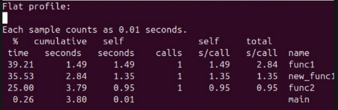

# Trabajo Práctico 1: El rendimiento de las computadoras

### Grupo: Apache Tevez

### Profesores:

- Miguel Angel Solinas

- Javier Jorge

## Integrantes

| Nombre                            | Correo Electrónico              |
| --------------------------------- | ------------------------------- |
| Facundo Emanuel Avila Diaz Moreno | facundo.avila.027@mi.unc.edu.ar |
| Candela Abigail Vergara           | candela.vergara@mi.unc.edu.ar   |
|                                   | @mi.unc.edu.ar                  |

## Introducción

En este trabajo práctico se tiene como objetivo el rendimiento de sistemas de cómputo. Por un lado, el análisis de hardware mediante benchmarks de tercero, y por otra parte, la medición de performance de código propio mediante herramientas de profiling.

## Parte 1: Benchmarks

Una prueba de rendimiento o comparativa (en inglés benchmark) es una técnica utilizada para medir el rendimiento de un sistema o uno de sus componentes. De manera formal, puede entenderse que una prueba de rendimiento es el resultado de la ejecución de un programa informático o un conjunto de programas en una máquina, con el objetivo de estimar el rendimiento de un elemento concreto, y poder comparar los resultados con máquinas similares.
En el ámbito de las computadoras, una prueba de rendimiento podría ser realizada en cualquiera de sus componentes, ya sea la CPU, RAM, tarjeta gráfica, etc. También puede estar dirigida específicamente a una función dentro de un componente, como la unidad de coma flotante de la CPU, o incluso a otros programas.
Los benchmarks devuelven información detallada de todas las características que posee y con base en dicha información, se puede evaluar si esta completamente optimizado para correr o ejecutar las aplicaciones que necesitamos dependiendo del área.

## Parte 2: Rendimiento y Speedup de dos procesadores

## Parte 3: Práctico ESP32

Para esta parte, se utiliza un microcontrolador ESP32, el cual se le puede variar la frecuencia. Se tiene que ejecutar un código que dure alrededor de 10 segundos, el cual debe ejecutar operaciones con números enteros y flotantes. Se tiene que variar la frecuencia del microcontrolador y verificar los tiempos.

Para esta prueba nos valemos del siguiente código:

```cpp
#include "esp32-hal-cpu.h"

void setup() {
Serial.begin(115200);
delay(1000);

// 1. Probamos a 80 MHz (Velocidad baja)
setCpuFrequencyMhz(80);
delay(500);
ejecutarPrueba();

// 2. Probamos a 160 MHz (Velocidad estándar)
setCpuFrequencyMhz(160);
delay(500);
ejecutarPrueba();

}

void ejecutarPrueba() {
uint32_t freq = getCpuFrequencyMhz();
Serial.printf("\n--- Test a %d MHz ---\n", freq);
Serial.flush();

long iteraciones = 100000000; // Mantenemos el mismo trabajo
volatile int suma = 0;

long t0 = micros();
for (long i = 0; i < iteraciones; i++) {
suma += 1;
}
long t1 = micros();

Serial.printf("Tiempo: %.4f segundos\n", (t1 - t0) / 1000000.0);
Serial.flush();
}

void loop() {}
```

### Salida del programa, variando la frecuencia de clock de la ESP32


## Parte 4: Profiling (gprof)
El profiling es el proceso de medir y analizar el rendimiento de un codigo, evaluando principalmente el tiempo de ejecución del programa, como asi tambien cuanto tiempo tarda en ejecutarse cada funcion. Permite identificar qué partes del código consumen más recursos, mediante herramientas llamadas profilers, que suelen utilizar técnicas como muestreo (perf) o inyeccion de codigo (gprof).

A partir de la realización del tutorial descripto en time profiling pudimos realizar el gprof de test_gprof.c y test_gprof_new.c, del cual obtuvimos un archivo txt que nos dio los resultados para el analisis ya que contiene toda la información de perfil deseada. Como ejemplo subimos el archivo `analisis_candela.txt`, el cual contiene dos tablas importantes:

+ **Perfil Plano:** Brinda una descripción general de la información de tiempo de las funciones, como el consumo de tiempo para la ejecución de una función en particular, cuántas veces se llamó, etc.

  

  Siendo:
  + Self seconds: tiempo de ejecucion propio de cada funcion.
  + %Time: porcentaje del tiempo total consumido por la funcion.
  + Total seconds: es el tiempo de la funcion + el de las funciones que llama (sus hijos).
  + Calls: cantidad de veces que fue llamada.

+ **Gráfico de llamadas:** representa las relaciones entre funciones, mostrando qué funciones llaman a una determinada función y cuáles son invocadas desde ella. Esto permite analizar la estructura de ejecución del programa y estimar el tiempo empleado en cada subrutina.
  
  


### Conclusiones sobre el uso del tiempo de las funciones

A partir del analisis de los resultados del profiling pudimos observar que la función func1 es la que mayor tiempo consume, representando aproximadamente el 39.21% del tiempo total de ejecución, esto indica que es la principal candidata a optimización, ya que es donde más tiempo pasa el programa. En segundo lugar, la función new_func1 utiliza alrededor del 35.53% del tiempo, esto sugiere que también tiene un impacto significativo en el rendimiento general.
Por otro lado, la función func2 consume un 25% del tiempo total, lo que la ubica como una función de importancia media en términos de consumo de recursos.
Finalmente, la función main tiene un impacto prácticamente despreciable (0.26% del tiempo total), lo cual es esperable, ya que generalmente se encarga solo de la coordinación del flujo del programa.
En conclusión, el profiling permite identificar que la mayor parte del tiempo de ejecución se concentra en pocas funciones (principalmente func1 y new_func1), lo cual es clave para enfocar esfuerzos de optimización de manera eficiente.
  


