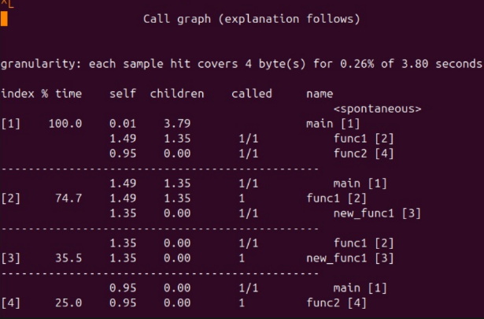

# Trabajo Práctico 1: El rendimiento de las computadoras

### Grupo: Apache Tevez

### Profesores:

- Miguel Angel Solinas

- Javier Jorge

## Integrantes

| Nombre                            | Correo Electrónico                |
| --------------------------------- | --------------------------------- |
| Facundo Emanuel Avila Diaz Moreno | facundo.avila.027@mi.unc.edu.ar   |
| Candela Abigail Vergara           | candela.vergara@mi.unc.edu.ar     |
| Joaquín Alejandro Salinas         | joaquin.salinas.874@mi.unc.edu.ar |

## Introducción

En este trabajo práctico se tiene como objetivo el rendimiento de sistemas de cómputo. Por un lado, el análisis de hardware mediante benchmarks de tercero, y por otra parte, la medición de performance de código propio mediante herramientas de profiling.

## 1. Armar una lista de benchmarks por tarea diaria

Un benchmark es un programa de prueba que mide el rendimiento de un sistema informático. La elección del benchmark más adecuado depende de las tareas que el usuario realiza habitualmente, ya que el rendmiento dependerá la aplicación que se va a hacer.
Los benchmarks se clasifican en 4 tipos:

- Sintéticos: programas artificiales diseñados para estresar un componente específico del sistema.
- Reducidos: fragmentos pequeños de código extraídos de pogramas reales.
- Kernel: aislan la parte computacionalmente más intesiva de una aplicación real.
- Programas reales: utilizan aplicaciones completas que el usuario usa cotidianamente.

| Tareas diaria                      | Benchmark        | Tipo      |
| ---------------------------------- | ---------------- | --------- |
| Rendimiento de funciones de python | pytest-benchmark | Kernel    |
| Comprimir archivos                 | 7-zip            | Sintetico |
| Rendimiento de GPU                 | 3DMark           | Sintetico |
| Operaciones de punto flotante      | LINKPACK         | Kernel    |

---

## 2. Rendimiento en compilación del kernel Linux

A continuación se vera el rendimiento en compilación del kernel de Linux para 3 diferentes procesadores:

- Plataforma de benchmarking: Phoronix Test Suite

| Procesadores              | Tiempo Promedio (seg) |
| ------------------------- | --------------------- |
| Intel core i5-13600K      | $72^{+/-5}$           |
| AMD Ryzen 9 5900X 12-Core | $76^{+/-8}$           |
| AMD Ryzen 9 7950X 16-Core | $50^{+/-6}$           |

A partir de los tiempos de compilación obtenidos, se puede calcular el rendimiento, el speedup y la eficiencia en compilación del kernel de Linux.

### Rendimiento

El rendimiento del procesador se define como el inverso del tiempo de ejecución, es decir, a menor tiempo de compilación, mayor rendimiento. A continuación se calcula el rendimiento de cada procesador en base a los tiempos obtenidos

$$
\eta_{prog} = \frac{1}{T_{prog}}
$$

| Procesadores              | Rendimiento |
| ------------------------- | ----------- |
| Intel core i5-13600K      | 0.0139      |
| AMD Ryzen 9 5900X 12-Core | 0.0132      |
| AMD Ryzen 9 7950X 16-Core | 0.02        |

> Podemos observar que el procesador AMD Ryzen 9 7950X demuestra el mayor rendimiento en compilación del kernel de Linux con un tiempo de 50 segundos

### Speedup

El speedup indica cuántas veces más rápido es un procesador respecto a uno de referencia (usaremos de referencia primero el procesador Intel core i5-13600K y posteriormente el AMD Ryzen 9 5900X 12-Core). Se calcula dividiendo el tiempo del procesador base por el tiempo del procesador a evaluar.

$$
Speedup = \frac{\text{Rendimiento mejorado}}{\text{Rendimiento original}} = \frac{EX_\text{CPU Original}}{EX_\text{CPU Mejorado}}
$$

- Tomando el procesador Intel core i5-13600K como referencia:

| Procesadores              | Speedup |
| ------------------------- | ------- |
| Intel core i5-13600K      | 1.000   |
| AMD Ryzen 9 5900X 12-Core | 0.947   |
| AMD Ryzen 9 7950X 16-Core | 1.440   |

> Tomando como referencia el i5-13600K el Ryzen 9 7950X logra un speedup de 1.44, es decir, compila un 44% más rápido. El Ryzen 9 5900X en cambio obtiene un speedup de 0.947, siendo más lento que la referencia

- Tomando el procesador AMD Ryzen 9 5900X 12-Core como referencia:

| Procesadores              | Speedup |
| ------------------------- | ------- |
| Intel core i5-13600K      | 1.056   |
| AMD Ryzen 9 5900X 12-Core | 1.000   |
| AMD Ryzen 9 7950X 16-Core | 1.520   |

> Al tomar el 5900X como referencia el 7950X sigue siendo el más rápido con un speedup de 1.52, y el i5-13600K lo supera con un speedup de 1.056. En ambos casos el AMD Ryzen 9 7950X demuestra la mayor aceleración, consolidándose como el procesador más rápido para esta tarea.

### Eficiencia

La eficiencia mide qué tan bien aprovecha un procesador sus recursos disponibles en relación al speedup obtenido. En este caso se analiza la eficiencia en función de la cantidad de núcleos, dividiendo el speedup de cada procesador por su número de núcleos.

$$
Eficiencia = \frac{Speedup}{n}
$$

- Intel core i5-13600K como referencia:

| Procesadores              | Cores | Eficiencia |
| ------------------------- | ----- | ---------- |
| Intel core i5-13600K      | 14    | 0.071      |
| AMD Ryzen 9 5900X 12-Core | 12    | 0.079      |
| AMD Ryzen 9 7950X 16-Core | 16    | 0.090      |

- AMD Ryzen 9 5900X 12-Core como referencia:

| Procesadores              | Cores | Eficiencia |
| ------------------------- | ----- | ---------- |
| Intel core i5-13600K      | 14    | 0.075      |
| AMD Ryzen 9 5900X 12-Core | 12    | 0.083      |
| AMD Ryzen 9 7950X 16-Core | 16    | 0.095      |

> En ambas referencias el AMD Ryzen 7950x obtiene la mayor eficiencia por núcleo, aprovechando mejor cada uno de sus 16 núcleos disponibles. Le sigue el Ryzen 9 5900x, que a pesar de tener menor rendimiento absoluto que el i5-13600k, logra una mayor eficiencia por núcleo al tener menos núcleos en total

A continuación se analizara también la eficiencia en términos económicos y energéticos. Para esto se analiza la eficiencia en costo tomando un precio de referencia de cada procesador y su consumo energético (TDP), permitiendo determinar cuál ofrece la mejor relación entre rendimiento obtenido y recursos invertidos.

$$
Eficiencia = \frac{Speedup}{Precio}
$$

$$
Eficiencia = \frac{Speedup}{TDP}
$$

- Intel core i5-13600K como referencia:

| Procesadores              | Costo (USD) | Eficiencia |
| ------------------------- | ----------- | ---------- |
| Intel core i5-13600K      | 320         | 0.00312    |
| AMD Ryzen 9 5900X 12-Core | 270         | 0.00351    |
| AMD Ryzen 9 7950X 16-Core | 498         | 0.00289    |

| Procesadores              | TDP (W) | Eficiencia |
| ------------------------- | ------- | ---------- |
| Intel core i5-13600K      | 125     | 0.0080     |
| AMD Ryzen 9 5900X 12-Core | 105     | 0.0091     |
| AMD Ryzen 9 7950X 16-Core | 170     | 0.0085     |

- Intel core AMD Ryzen 9 5900X 12-Core como referencia:

| Procesadores              | Costo (USD) | Eficiencia |
| ------------------------- | ----------- | ---------- |
| Intel core i5-13600K      | 320         | 0.0033     |
| AMD Ryzen 9 5900X 12-Core | 270         | 0.0037     |
| AMD Ryzen 9 7950X 16-Core | 498         | 0.0031     |

| Procesadores              | TDP (W) | Eficiencia |
| ------------------------- | ------- | ---------- |
| Intel core i5-13600K      | 125     | 0.0085     |
| AMD Ryzen 9 5900X 12-Core | 105     | 0.0095     |
| AMD Ryzen 9 7950X 16-Core | 170     | 0.0089     |

> En ambas referencias el AMD Ryzen 9 5900X resulta ser el más eficiente en términos de costo ofreciendo la mejor relación entre speedup y precio. El AMD Ryzen 9 7950X, a pesar de ser el más rápido, resulta el menos eficiente económicamente debido a su alto precio. El i5-13600K se ubica en un punto intermedio.
> En términos energéticos el AMD Ryzen 9 5900X también resulta el más eficiente en ambas referencias, logrando la mejor relación entre speedup y consumo eléctrico gracias a su bajo TDP de 105W. El AMD Ryzen 9 7950X, si bien obtiene el mayor rendimiento absoluto, consume significativamente más energía. El i5-13600K se posiciona entre ambos.

## Parte 3: Práctico ESP32

Para esta parte, se utiliza un microcontrolador ESP32, el cual se le puede variar la frecuencia. Se tiene que ejecutar un código que dure alrededor de 10 segundos, el cual debe ejecutar operaciones con números enteros y flotantes. Se tiene que variar la frecuencia del microcontrolador y verificar los tiempos.

Para esta prueba nos valemos del siguiente código:

```cpp
#include "esp32-hal-cpu.h"

void setup() {
Serial.begin(115200);
delay(1000);

// 1. Probamos a 80 MHz (Velocidad baja)
setCpuFrequencyMhz(80);
delay(500);
ejecutarPrueba();

// 2. Probamos a 160 MHz (Velocidad estándar)
setCpuFrequencyMhz(160);
delay(500);
ejecutarPrueba();

}

void ejecutarPrueba() {
uint32_t freq = getCpuFrequencyMhz();
Serial.printf("\n--- Test a %d MHz ---\n", freq);
Serial.flush();

long iteraciones = 100000000; // Mantenemos el mismo trabajo
volatile int suma = 0;

long t0 = micros();
for (long i = 0; i < iteraciones; i++) {
suma += 1;
}
long t1 = micros();

Serial.printf("Tiempo: %.4f segundos\n", (t1 - t0) / 1000000.0);
Serial.flush();
}

void loop() {}
```

### Salida del programa, variando la frecuencia de clock de la ESP32


## Parte 4: Profiling (gprof)

El profiling es el proceso de medir y analizar el rendimiento de un codigo, evaluando principalmente el tiempo de ejecución del programa, como asi tambien cuanto tiempo tarda en ejecutarse cada funcion. Permite identificar qué partes del código consumen más recursos, mediante herramientas llamadas profilers, que suelen utilizar técnicas como muestreo (perf) o inyeccion de codigo (gprof).

A partir de la realización del tutorial descripto en time profiling pudimos realizar el gprof de test_gprof.c y test_gprof_new.c, del cual obtuvimos un archivo txt que nos dio los resultados para el analisis ya que contiene toda la información de perfil deseada. Como ejemplo subimos el archivo `analisis_candela.txt`, el cual contiene dos tablas importantes:

- **Perfil Plano:** Brinda una descripción general de la información de tiempo de las funciones, como el consumo de tiempo para la ejecución de una función en particular, cuántas veces se llamó, etc.

  

  Siendo:
  - Self seconds: tiempo de ejecucion propio de cada funcion.
  - %Time: porcentaje del tiempo total consumido por la funcion.
  - Total seconds: es el tiempo de la funcion + el de las funciones que llama (sus hijos).
  - Calls: cantidad de veces que fue llamada.

- **Gráfico de llamadas:** representa las relaciones entre funciones, mostrando qué funciones llaman a una determinada función y cuáles son invocadas desde ella. Esto permite analizar la estructura de ejecución del programa y estimar el tiempo empleado en cada subrutina.

  

## Conclusiones sobre el uso del tiempo de las funciones

A partir del analisis de los resultados del profiling pudimos observar que la función func1 es la que mayor tiempo consume, representando aproximadamente el 39.21% del tiempo total de ejecución, esto indica que es la principal candidata a optimización, ya que es donde más tiempo pasa el programa. En segundo lugar, la función new_func1 utiliza alrededor del 35.53% del tiempo, esto sugiere que también tiene un impacto significativo en el rendimiento general.
Por otro lado, la función func2 consume un 25% del tiempo total, lo que la ubica como una función de importancia media en términos de consumo de recursos.
Finalmente, la función main tiene un impacto prácticamente despreciable (0.26% del tiempo total), lo cual es esperable, ya que generalmente se encarga solo de la coordinación del flujo del programa.
En conclusión, el profiling permite identificar que la mayor parte del tiempo de ejecución se concentra en pocas funciones (principalmente func1 y new_func1), lo cual es clave para enfocar esfuerzos de optimización de manera eficiente.
