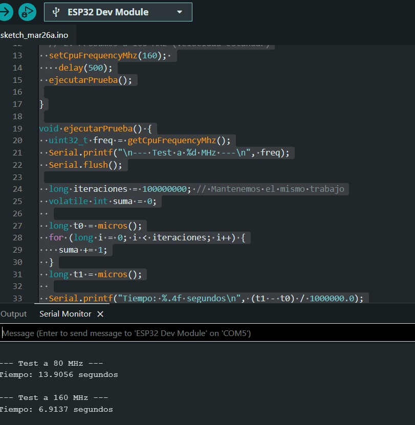

# Trabajo Práctico 1: El rendimiento de las computadoras

### Grupo: Apache Tevez

### Profesores:

- Miguel Angel Solinas

- Javier Jorge

## Integrantes

| Nombre                            | Correo Electrónico              |
| --------------------------------- | ------------------------------- |
| Facundo Emanuel Avila Diaz Moreno | facundo.avila.027@mi.unc.edu.ar |
|                                   | @mi.unc.edu.ar                  |
|                                   | @mi.unc.edu.ar                  |

## Introducción

En este trabajo práctico se tiene como objetivo el rendimiento de sistemas de cómputo. Por un lado, el análisis de hardware mediante benchmarks de tercero, y por otra parte, la medición de performance de código propio mediante herramientas de profiling.

## Parte 1: Benchmarks

Una prueba de rendimiento o comparativa (en inglés benchmark) es una técnica utilizada para medir el rendimiento de un sistema o uno de sus componentes. De manera formal, puede entenderse que una prueba de rendimiento es el resultado de la ejecución de un programa informático o un conjunto de programas en una máquina, con el objetivo de estimar el rendimiento de un elemento concreto, y poder comparar los resultados con máquinas similares.
En el ámbito de las computadoras, una prueba de rendimiento podría ser realizada en cualquiera de sus componentes, ya sea la CPU, RAM, tarjeta gráfica, etc. También puede estar dirigida específicamente a una función dentro de un componente, como la unidad de coma flotante de la CPU, o incluso a otros programas.
Los benchmarks devuelven información detallada de todas las características que posee y con base en dicha información, se puede evaluar si esta completamente optimizado para correr o ejecutar las aplicaciones que necesitamos dependiendo del área.

## Parte 2: Rendimiento y Speedup de dos procesadores

## Parte 3: Práctico ESP32

Para esta parte, se utiliza un microcontrolador ESP32, el cual se le puede variar la frecuencia. Se tiene que ejecutar un código que dure alrededor de 10 segundos, el cual debe ejecutar operaciones con números enteros y flotantes. Se tiene que variar la frecuencia del microcontrolador y verificar los tiempos.

Para esta prueba nos valemos del siguiente código:

```cpp
#include "esp32-hal-cpu.h"

void setup() {
Serial.begin(115200);
delay(1000);

// 1. Probamos a 80 MHz (Velocidad baja)
setCpuFrequencyMhz(80);
delay(500);
ejecutarPrueba();

// 2. Probamos a 160 MHz (Velocidad estándar)
setCpuFrequencyMhz(160);
delay(500);
ejecutarPrueba();

}

void ejecutarPrueba() {
uint32_t freq = getCpuFrequencyMhz();
Serial.printf("\n--- Test a %d MHz ---\n", freq);
Serial.flush();

long iteraciones = 100000000; // Mantenemos el mismo trabajo
volatile int suma = 0;

long t0 = micros();
for (long i = 0; i < iteraciones; i++) {
suma += 1;
}
long t1 = micros();

Serial.printf("Tiempo: %.4f segundos\n", (t1 - t0) / 1000000.0);
Serial.flush();
}

void loop() {}
```

### Salida del programa, variando la frecuencia de clock de la ESP32


