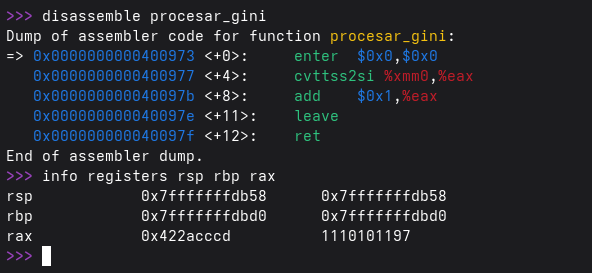
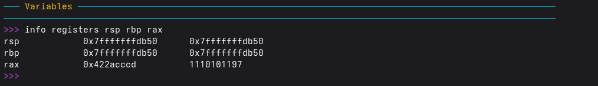
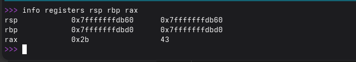

# TP2 — Calculadora de Índices GINI

### Grupo: Apache Tevez

### Profesores:

- Miguel Angel Solinas

- Javier Jorge

## Integrantes

| Nombre                            | Correo Electrónico                |
| --------------------------------- | --------------------------------- |
| Facundo Emanuel Avila Diaz Moreno | facundo.avila.027@mi.unc.edu.ar   |
| Candela Abigail Vergara           | candela.vergara@mi.unc.edu.ar     |
| Joaquín Alejandro Salinas         | joaquin.salinas.874@mi.unc.edu.ar |
---

## Introducción

El presente trabajo práctico implementa una calculadora de índices GINI utilizando una arquitectura de tres capas que demuestra la interacción entre lenguajes de alto y bajo nivel. El sistema consume datos reales del Banco Mundial mediante una API REST, los procesa a través de código en C que invoca rutinas escritas en ensamblador x86-64, y muestra los resultados al usuario.

El objetivo principal no es la operación matemática en sí (conversión de float a entero y suma de 1), sino comprender y demostrar cómo funciona la **convención de llamada System V AMD64 ABI**: cómo se pasan argumentos entre C y ASM, cómo se construye y destruye un stack frame, y cómo viaja el resultado de vuelta al calle. Por otro lado se puede apreciar como trabaja un lenguaje de bajo nivel (assembler), realizandose operaciones de los registros del procesador. 

---

## Arquitectura del sistema

El sistema se organiza en tres capas:

```
┌──────────────────────────────────────────────┐
│  CAPA ALTA: Python / C                       │
│  Consume la API REST del Banco Mundial       │
│  Obtiene los índices GINI como floats        │
├──────────────────────────────────────────────┤
│  CAPA MEDIA: C                               │
│  Recibe los valores float                    │
│  Invoca la rutina en ensamblador             │
├──────────────────────────────────────────────┤
│  CAPA BAJA: Ensamblador x86-64              │
│  Convierte float → int (truncando)           │
│  Suma 1 al resultado                         │
│  Devuelve el entero en %eax                  │
└──────────────────────────────────────────────┘
```

Se implementaron dos variantes del flujo completo:

- **Python + C:** Python consume la API con `requests`, carga la shared library `libgini.so` mediante `ctypes`, y llama a la función `procesar_gini` implementada en C.
- **C + ASM:** C consume la API con `libcurl`, parsea el JSON con `cJSON`, y llama directamente a la función `procesar_gini` en ensamblador. Esta variante permite la depuración con GDB.

---

## Iteración 1 — Python + C (sin ensamblador)

En la primera iteración se resolvió el flujo completo utilizando Python y C, sin ensamblador. Python consume la API del Banco Mundial y pasa los datos a una función en C compilada como shared library (`.so`), que realiza la conversión de float a entero y la suma de 1. Los resultados se muestran desde Python.

El objetivo de esta iteración fue validar la arquitectura de capas y la comunicación entre Python y C mediante `ctypes`, estableciendo la interfaz que después se mantendría idéntica al incorporar ensamblador.

### Compilación de la shared library

```bash
gcc -shared -fPIC -o libgini.so gini.c
```

### Uso desde Python con ctypes

```python
import ctypes

libgini = ctypes.CDLL('./libgini.so')
libgini.procesar_gini.argtypes = (ctypes.c_float,)
libgini.procesar_gini.restype = ctypes.c_int

resultado = libgini.procesar_gini(42.7)
```

---

## Iteración 2 — Incorporación de ensamblador

En la segunda iteración se reemplazó la lógica de conversión en C por una rutina escrita en ensamblador x86-64 utilizando GNU Assembler (GAS) con sintaxis AT&T.

### Rutina en ensamblador: `conversor.s`

```asm
    .text
    .globl procesar_gini
procesar_gini:
    enter $0, $0            # Prólogo: push %rbp + mov %rsp,%rbp
    cvttss2si %xmm0, %eax   # Convierte float → int (truncando)
    add       $1, %eax       # Suma 1
    leave                    # Epílogo: mov %rbp,%rsp + pop %rbp
    ret                      # Retorna, resultado en %eax
```

### Explicación de las instrucciones

**`enter $0, $0`:** Instrucción compacta que equivale a `push %rbp` seguido de `mov %rsp, %rbp`. Crea el stack frame de la función guardando el frame pointer del caller y estableciendo un nuevo punto de referencia.

**`cvttss2si %xmm0, %eax`:** Convierte un float escalar (Scalar Single) a un entero escalar (Scalar Integer), truncando hacia cero. El nombre se descompone como: ConVerT, Truncate, Scalar Single, to, Scalar Integer. El float llega en `%xmm0` (primer argumento flotante según la convención SysV AMD64) y el resultado entero queda en `%eax`.

**`add $1, %eax`:** Suma la constante 1 al valor entero en `%eax`.

**`leave`:** Instrucción compacta que equivale a `mov %rbp, %rsp` seguido de `pop %rbp`. Deshace el stack frame restaurando el puntero de pila y el frame pointer del caller.

**`ret`:** Extrae la dirección de retorno del tope de la pila y salta a ella. El resultado de la función queda en `%eax`, que es donde la convención de llamada establece que va el valor de retorno entero.

### Convención de llamada System V AMD64 ABI

La comunicación entre C y ASM se rige por la convención System V AMD64 ABI, que establece las siguientes reglas:

Los argumentos enteros o punteros se pasan en los registros `%rdi`, `%rsi`, `%rdx`, `%rcx`, `%r8` y `%r9` (en ese orden). Los argumentos de punto flotante (float/double) se pasan en `%xmm0` a `%xmm7`. Si hay más argumentos que registros disponibles, los restantes van por la pila.

El valor de retorno entero queda en `%rax` (o `%eax` para 32 bits), y el valor de retorno flotante queda en `%xmm0`.

En nuestra función, como recibe un solo float, el argumento viaja en `%xmm0`. Como devuelve un entero, el resultado queda en `%eax`.

---

## Programa en C con API REST: `number_conversor.c`

Para la demostración con GDB, se implementó un programa en C que consume la API del Banco Mundial directamente usando `libcurl` para las peticiones HTTP y `cJSON` para el parseo del JSON.

```c
#include <stdio.h>
#include <curl/curl.h>
#include <stdlib.h>
#include <string.h>
#include "cJSON.h"

#define API_URL "https://api.worldbank.org/v2/en/country/AR/indicator/SI.POV.GINI?format=json&date=2011:2020&per_page=100"

extern int procesar_gini(float value);
```

La función `fetch_api()` realiza el request HTTP, parsea el JSON recibido, extrae el valor GINI de cada registro, y lo pasa a `procesar_gini()` (la rutina ASM) para obtener el entero convertido.

### Compilación

```bash
# Ensamblar la rutina ASM
as --64 -g -o conversor.o conversor.s

# Compilar cJSON
gcc -g3 -O0 -c -o cJSON.o cJSON.c

# Compilar el programa principal
gcc -g3 -O0 -c -o number_conversor.o number_conversor.c

# Linkear todo
gcc -g3 -O0 -o programa number_conversor.o conversor.o cJSON.o -lcurl
```

### Ejecución y resultado

```
$ ./programa
Argentina - 2020: 43
Argentina - 2019: 44
Argentina - 2018: 42
Argentina - 2017: 42
Argentina - 2016: 43
Argentina - 2014: 42
Argentina - 2013: 42
Argentina - 2012: 42
Argentina - 2011: 43
```

## Demostración con GDB

Se utilizó GDB para inspeccionar el estado del stack y los registros en tres momentos clave durante la ejecución de `procesar_gini`: antes, durante y después de la llamada.

### Inicio de la sesión

```
$ gdb ./programa
(gdb) break procesar_gini
Breakpoint 1 at 0x400973: file conversor.s, line 11.
(gdb) run
```

### Disassembly de `procesar_gini`

```
(gdb) disassemble procesar_gini
Dump of assembler code for function procesar_gini:
   0x0000000000400973 <+0>:   enter  $0x0,$0x0
   0x0000000000400977 <+4>:   cvttss2si %xmm0,%eax
   0x000000000040097b <+8>:   add    $0x1,%eax
   0x000000000040097e <+11>:  leave
   0x000000000040097f <+12>:  ret
```

### Momento 1: ANTES — al entrar a la función, antes del prólogo



En este momento, `%xmm0` contiene el valor 42.7 (el índice GINI de Argentina 2020) y el tope del stack (`%rsp`) apunta a la dirección de retorno que `call` empujó a la pila.

### Momento 2: DURANTE — después del prólogo (`enter`)



El `enter` ejecutó `push %rbp` (guardando el frame pointer de `fetch_api` en la pila) y `mov %rsp, %rbp` (estableciendo el nuevo frame). Se observa que `%rsp` bajó 8 bytes (de `db58` a `db50`) y ahora `%rbp` = `%rsp`, ambos apuntando al nuevo stack frame. En la pila se puede ver el `%rbp` anterior (`0x7fffffffdbd0`) seguido de la dirección de retorno.

### Momento 3: DESPUÉS — tras `leave` y `ret`



Después de `leave` y `ret`, el stack frame fue completamente liberado. `%rsp` volvió a su valor original (incluso subió por encima de donde estaba la dirección de retorno, ya que `ret` la extrajo). `%rbp` fue restaurado al valor del frame de `fetch_api` (`0x7fffffffdbd0`). El resultado **43** está en `%eax` (`0x2b`), listo para ser leído por el código C.


## Ambiente de trabajo

- **Compilador C:** GCC 15.2.1
- **Ensamblador:** GNU Assembler (GAS), sintaxis AT&T
- **Depurador:** GDB 17.1
- **Librerías:** libcurl, cJSON
- **Python:** 3.x con `requests` y `ctypes`
- **Control de versiones:** Git + GitHub

---


## Conclusiones

El trabajo permitió comprender en profundidad la interacción entre lenguajes de alto y bajo nivel a través de la convención de llamada System V AMD64 ABI. Se verificó experimentalmente que los argumentos de punto flotante viajan en los registros SSE (`%xmm0`), que el valor de retorno entero se deposita en `%eax`, y que el mecanismo de prólogo/epílogo (`enter`/`leave`) construye y destruye correctamente el stack frame.

La inspección con GDB permitió observar byte a byte cómo la pila almacena la dirección de retorno y el frame pointer del caller, y cómo estos valores se restauran al finalizar la función, asegurando que el programa vuelva correctamente al punto de llamada.

La arquitectura de tres capas demuestra que un sistema puede integrar distintos niveles de abstracción (Python, C, ASM) de forma transparente, donde cada capa superior desconoce los detalles de implementación de la capa inferior.