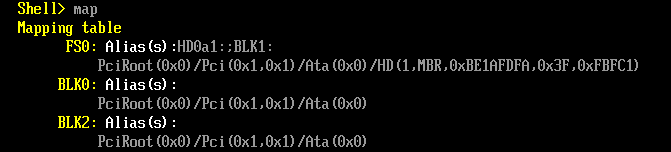
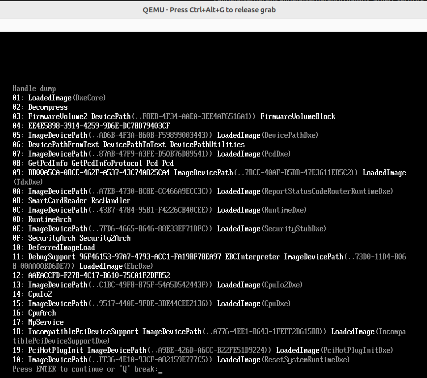
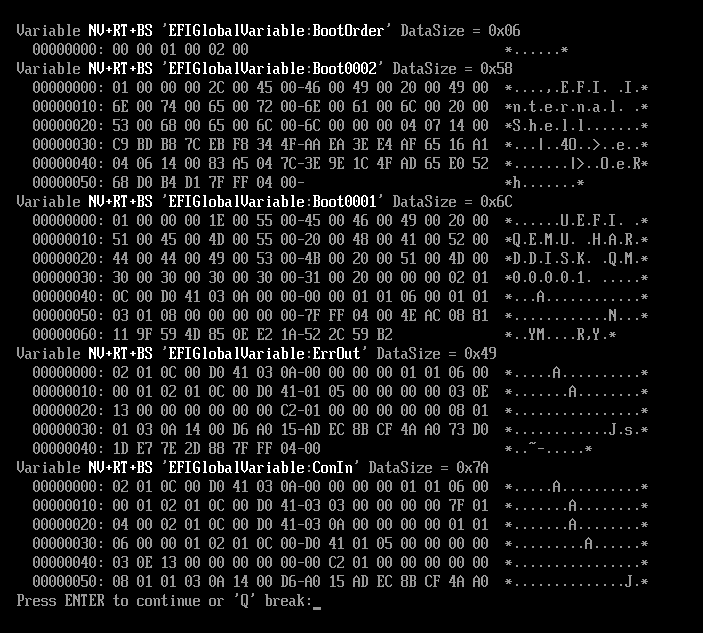
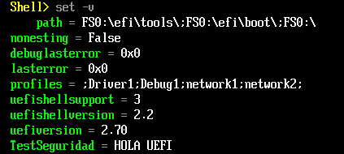
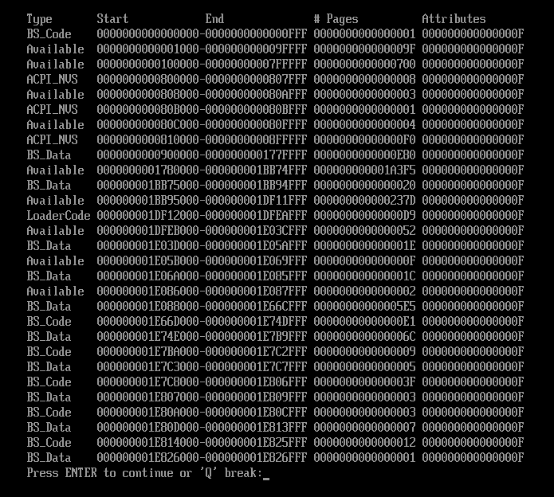
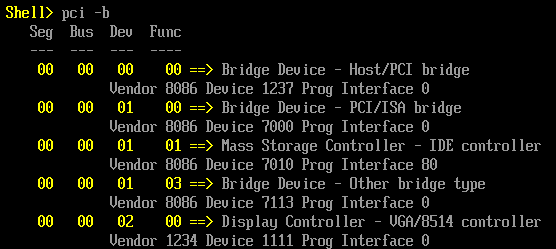
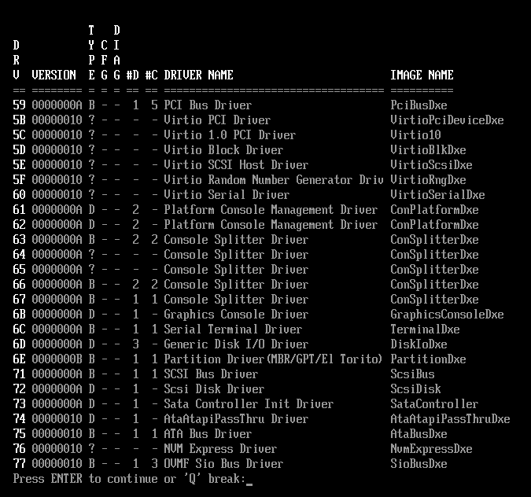
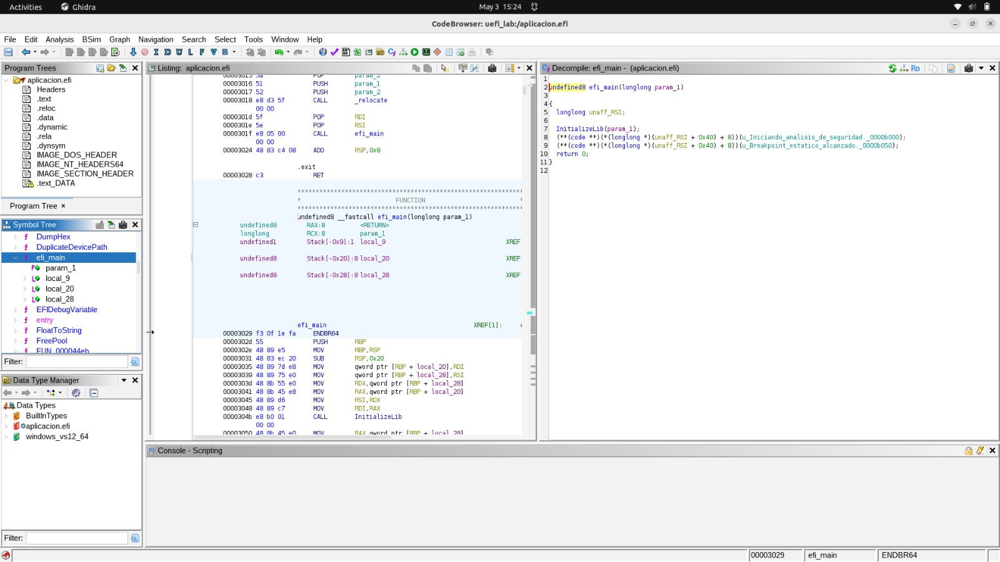
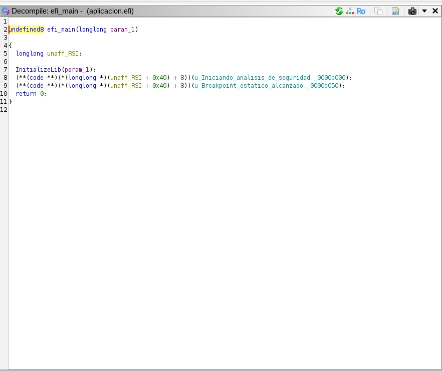

# TP3 — Arquitectura y Fundamentos del Firmware UEFI

### Grupo: Apache Tevez

### Profesores:

- Miguel Angel Solinas

- Javier Jorge

## Integrantes

| Nombre                            | Correo Electrónico                |
| --------------------------------- | --------------------------------- |
| Facundo Emanuel Avila Diaz Moreno | facundo.avila.027@mi.unc.edu.ar   |
| Candela Abigail Vergara           | candela.vergara@mi.unc.edu.ar     |
| Joaquín Alejandro Salinas         | joaquin.salinas.874@mi.unc.edu.ar |

## Trabajo Práctico 1: Exploración del entorno UEFI y la Shell

### 1.1 Arranque en el entorno virtual
Para explorar el entorno UEFI se utilizó el emulador QEMU junto con OVMF (Open Virtual Machine Firmware), que provee una implementación abierta de UEFI. A diferencia del BIOS Legacy, UEFI no se limita a cargar el MBR, sino que ejecuta un entorno pre-OS con servicios propios como gestión de memoria, drivers y consola.

El sistema se inició con el siguiente comando:

`qemu-system-x86_64 -m 512 -bios /usr/share/ovmf/OVMF.fd -net none`

Al arrancar, se accedió a la UEFI Shell, desde donde es posible interactuar directamente con los servicios del firmware sin intervención de un sistema operativo, lo que permite analizar cómo UEFI abstrae el hardware y gestiona recursos en una etapa temprana del arranque.

### 1.2 Exploración de Dispositivos (Handles y Protocolos)

En la UEFI Shell se ejecutaron los siguientes comandos para explorar los dispositivos disponibles:

```Shell> map
Shell> FS0:
FS0:\> ls
Shell> dh -b
```

El comando `map` lista todos los dispositivos detectados por UEFI y los asocia a identificadores lógicos como `FS0:`, `BLK0:`, etc. En particular, los `FSx:` representan sistemas de archivos accesibles. 



Luego, al ingresar a `FS0:` se cambia el contexto a ese sistema de archivos, permitiendo interactuar con él como si fuera un directorio. El comando `ls` lista el contenido del sistema de archivos actual, permitiendo verificar qué archivos o ejecutables EFI están disponibles.

Por su parte, `dh -b` (device handles) muestra en detalle los handles presentes en el sistema junto con los protocolos asociados a cada uno, permitiendo ver cómo UEFI vincula dispositivos con sus interfaces de acceso.



A diferencia del modelo tradicional basado en BIOS, donde los dispositivos se accedían mediante direcciones físicas o interrupciones, UEFI organiza los recursos mediante una arquitectura basada en handles (identificadores) y protocolos (interfaces). Esto introduce un nivel de abstracción que desacopla el software del hardware subyacente.

¿Cuál es la ventaja de seguridad y compatibilidad de este modelo frente al antiguo BIOS?

El modelo basado en handles y protocolos abstrae el hardware físico, desacoplando el software de detalles específicos como puertos o direcciones fijas. Esto mejora la compatibilidad porque un mismo binario puede ejecutarse en distintas plataformas sin depender de la implementación del hardware. Además, aumenta la seguridad al limitar el acceso directo a recursos físicos: los módulos sólo interactúan a través de interfaces definidas por UEFI, lo que reduce la superficie de ataque y evita manipulaciones directas de bajo nivel como ocurría en BIOS.


### 1.3 Exploración de Dispositivos (Handles y Protocolos)

En esta sección se exploraron las variables globales almacenadas en NVRAM (Non-Volatile RAM), una memoria no volátil donde UEFI guarda configuraciones que deben persistir entre reinicios. UEFI utiliza estas variables para definir su comportamiento, especialmente el proceso de arranque. En lugar de tener una lógica fija como el BIOS, el firmware se basa en estas variables para decidir qué hacer.

Se ejecutaron los siguientes comandos para el analisis:
```
Shell> dmpstore
Shell> set TestSeguridad "Hola UEFI"
Shell> set -v
```

El comando `dmpstore` lista todas las variables almacenadas en NVRAM junto con su contenido. Entre ellas se destacan las variables `Boot####` (por ejemplo `Boot0000`, `Boot0001`), que representan entradas de arranque individuales, cada una apuntando a un dispositivo o archivo EFI específico.



El comando `set` permite crear o modificar variables de entorno dentro de la shell. En este caso, se creó una variable de prueba (TestSeguridad) para verificar manipulación de variables en el entorno.
Por otro lado, `set -v` muestra todas las variables disponibles, incluyendo tanto variables de shell como variables globales.



Estas variables son fundamentales durante la fase BDS (Boot Device Selection), donde el firmware decide qué cargar antes de transferir el control al sistema operativo.

¿Cómo determina el Boot Manager la secuencia de arranque?

El Boot Manager utiliza la variable `BootOrder`, que contiene una lista ordenada de identificadores `(Boot####)`. Cada entrada `Boot####` define un dispositivo o ruta a un ejecutable EFI. Durante el arranque, el firmware recorre BootOrder en orden secuencial e intenta cargar cada opción hasta que una se ejecuta correctamente. De esta forma, la secuencia de arranque no está fija en el código del firmware, sino que está completamente definida por estas variables almacenadas en NVRAM.

### 1.4 Footprinting de Memoria y Hardware
En esta sección se realizó un relevamiento (footprinting) de los recursos del sistema disponibles en el entorno UEFI, incluyendo memoria, dispositivos PCI y drivers cargados.

Se utilizaron los siguientes comandos:

```
Shell> memmap -b
Shell> pci -b
Shell> drivers -b
```

El comando `memmap -b` muestra el mapa de memoria del sistema, indicando las distintas regiones y su tipo (por ejemplo: LoaderCode, BootServicesCode, RuntimeServicesCode, etc.). Esto permite entender cómo UEFI organiza la memoria y qué áreas están reservadas para distintas funciones del firmware.



El comando `pci -b` lista los dispositivos conectados al bus PCI, incluyendo información como vendor ID, device ID y clase del dispositivo. Esto resulta útil para identificar el hardware presente desde el firmware, sin intervención del sistema operativo.



Por último, `drivers -b` muestra los drivers UEFI cargados en memoria y los handles a los que están asociados, evidenciando cómo el firmware gestiona dinámicamente los dispositivos a través de su modelo de protocolos.



¿Por qué las regiones RuntimeServicesCode son un objetivo principal para malware (Bootkits)?

Las regiones RuntimeServicesCode contienen código del firmware que permanece accesible incluso después de que el sistema operativo toma el control. Esto significa que no se descartan durante la transición al OS, sino que siguen activas despues del arranque.
Desde el punto de vista de seguridad, esto las convierte en un objetivo crítico: un bootkit que logre inyectar código en estas regiones puede persistir más allá del arranque y ejecutarse con privilegios elevados, incluso antes que muchos mecanismos de defensa del sistema operativo. Además, al operar en una capa inferior al OS, este tipo de malware es difícil de detectar y puede evadir soluciones tradicionales de seguridad.


## Trabajo Práctico 2: Desarrollo, compilación y análisis de seguridad

### 2.1 Desarrollo de la aplicación

Se utilizó el código fuente provisto en la guía (`aplicación.c`), que implementa una aplicación UEFI nativa en C. La aplicación recibe como párametros el `ImageHandle` y un puntero a la `EFI_SYSTEM_TABLE`, incializa la librería con `InitializeLib()`, y utiliza `SystemTable->ConOut->OutputString` para imprimir dos mensajes en la consola del firmware. Además, declara un array con el byte `0xCC` (opcode de la instrucción `INT3`) y verifica su valor mediante una condición `if`.

```C
#include <efi.h>
#include <efilib.h>
EFI_STATUS efi_main(EFI_HANDLE ImageHandle, EFI_SYSTEM_TABLE *SystemTable) {
InitializeLib(ImageHandle, SystemTable);
SystemTable->ConOut->OutputString(SystemTable->ConOut, L"Iniciando analisis de seguridad...\r\n");
// Inyección de un software breakpoint (INT3)
unsigned char code[] = { 0xCC };
if (code[0] == 0xCC) {
SystemTable->ConOut->OutputString(SystemTable->ConOut, L"Breakpoint estatico alcanzado.\r\n");
}
return EFI_SUCCESS;
}

```

#### ¿Por qué utilizamos `SystemTable->ConOut->OutputString` en lugar de la función `printf` de C?

Se utiliza `SystemTable->ConOut->OutputString` porque no hay sistema operativo cargado, por lo tanto no existe la librería estándar de C. `printf` depende de libc, que necesita un OS para gestionar stdout y syscalls. En UEFI, el firmware expone sus servicios a través de la System Table: `ConOut` es el protocolo SIMPLE_TEXT_OUTPUT y `OutputString` es la función que escribe directamente en pantalla a través del firmware.

### 2.2 Compilación a formato PE/COFF

El proceso de compilación se realizó en tres etapas desde Linux. Primero se compiló el código fuente a un archivo de objeto (`.o`) con `gcc` usando flags específicas para un entorno freestanding (`ffreestanding`, `-fno-stack-protector`,`-mno-red-zone`), ya que no existe libc ni sistema operativo. Luego se linkeó el objeto a un `.so` intermedio en formato ELF utilizando `ld` con el linker script `elf_x86_64_efi.lds` y el startup object `crt0-efi-x86_64.o` provistos por `gnu-efi`. Finalmente, se convirtió el ELF a formato PE/COFF mediante `objcopy` con el target `efi-app-x86_64`, generando el ejecutable `aplicacion.efi`.
Se verificó el resultado con `file aplicacion.efi`, que confirmó el formato `PE32+executable (EFI application)`. Al ejecutar `readelf -h aplicacion.efi` se obtuvo un error ("Not an ELF file"), lo cual es esperado: el archivo ya no es ELF (formato de Linux) sino PE/COFF (formato requerido por la especificación UEFI), confirmando que la conversión fue exitosa.

### 2.3 Análisis de metadatos y compilación

Se importó `aplicacion.efi` en Ghidra para analizar el binario a nivel de pseudocódigo. Al decompilar la función `efi_main`, se observó que Ghidra representa las llamadas a `OutputString` como operaciones con punteros crudos y offsets de memoria (por ejemplo, `(*(longlong *)(unaff_RSI + 0x40) + 8)`), ya que el decompilador no posee las definiciones de tipos de UEFI como `EFI_SYSTEM_TABLE` o `SIMPLE_TEXT_OUTPUT_PROTOCOL`. El registro `unaff_RSI` corresponde al puntero a la System Table que recibe la función como parámetro. También se observó que el compilador optimizó la condición `if (code[0] == 0xCC)`, eliminándola del binario al detectar que siempre es verdadera.



**Figura 1:** Vista del CodeBrowser de Ghidra con la función efi_main seleccionada. A la izquierda se observa el Symbol Tree con las funciones del binario, en el centro el Listing con el código ensamblador x86-64, y a la derecha el panel Decompiler con el pseudocódigo generado.


**Figura 2:** Pseudocódigo decompilado de efi_main por Ghidra. Se observa que las llamadas a OutputString se representan como punteros crudos con offsets (unaff_RSI + 0x40), ya que Ghidra no posee las definiciones de tipos de UEFI. También se evidencia que el compilador eliminó la condición if (code[0] == 0xCC) al detectar que siempre era verdadera, ejecutando ambos OutputString de forma secuencial.

####  En el pseudocódigo de Ghidra, la condición 0xCC suele aparecer como -52. ¿A qué se debe este fenómeno y por qué importa en ciberseguridad?

En el pseudocódigo de Ghidra, `0xCC` aparece como `-52` porque el decompilador interpreta el byte como `signed char` en lugar de `unsigned char`. El valor `0xCC` en binario es `11001100`; como unsigned equivale a 204, pero como signed, al tener el bit más significativo en 1, se interpreta en complemento a 2: 256 - 204 = 52, resultando en `-52`. Son los mismos bits con distinta interpretación de signo. Esto es relevante en ciberseguridad porque `0xCC` es el opcode de la instrucción `INT3` (software breakpoint en x86), utilizado tanto por debuggers como por malware como técnica anti-debugging. Si un analista no reconoce que `-52` en el pseudocódigo es en realidad `0xCC/INT3`, podría pasar por alto una instrucción de breakpoint inyectada en un binario malicioso.
